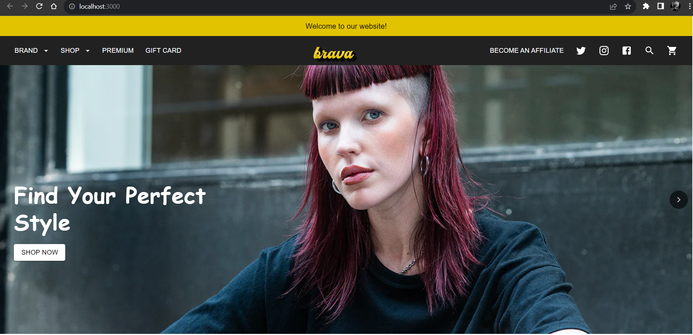

# Project Name

[Project Name Here]

## Technology Used
  - [Next.js](https://nextjs.org/)
  - [React.js](https://reactjs.org/)
  - [Material-UI](https://mui.com/)

## Screenshots

### Desktop View

### Mobile View

## How to Run

To run this project locally, follow these steps:

- Clone the repository: `git clone [repository_url]`
- Navigate to the project directory: `cd [project_directory]`
- Install dependencies: `npm install` or `yarn install`
- Start the development server: `npm run dev` or `yarn dev`
- Open your browser and go to [http://localhost:3000](http://localhost:3000)

[Add any additional steps or considerations for running the project]
